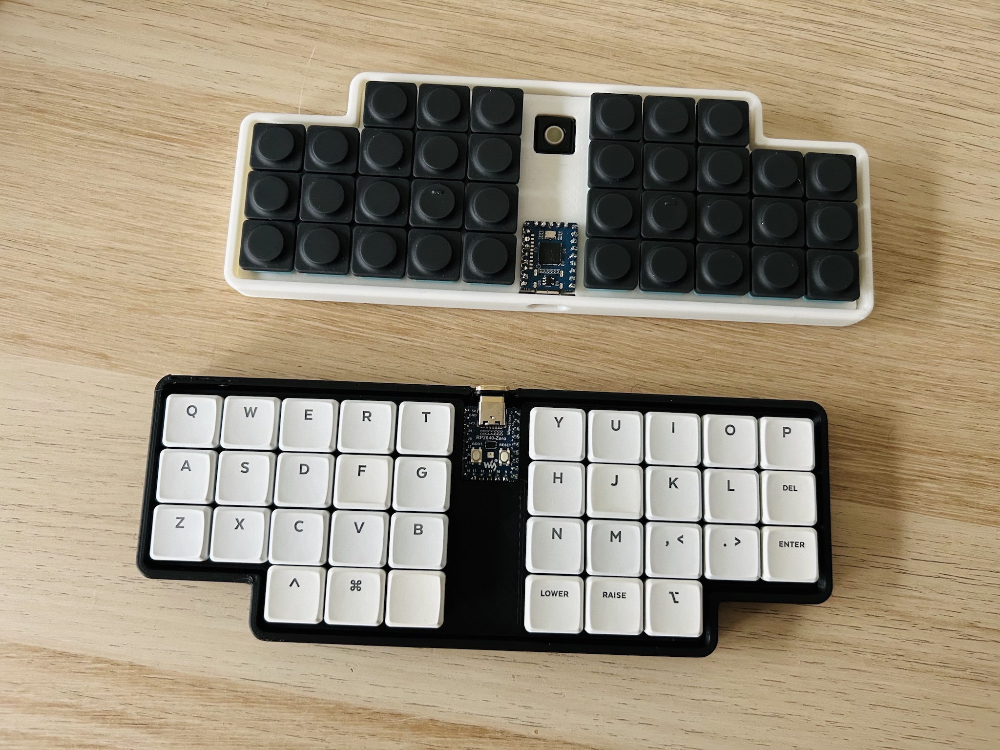
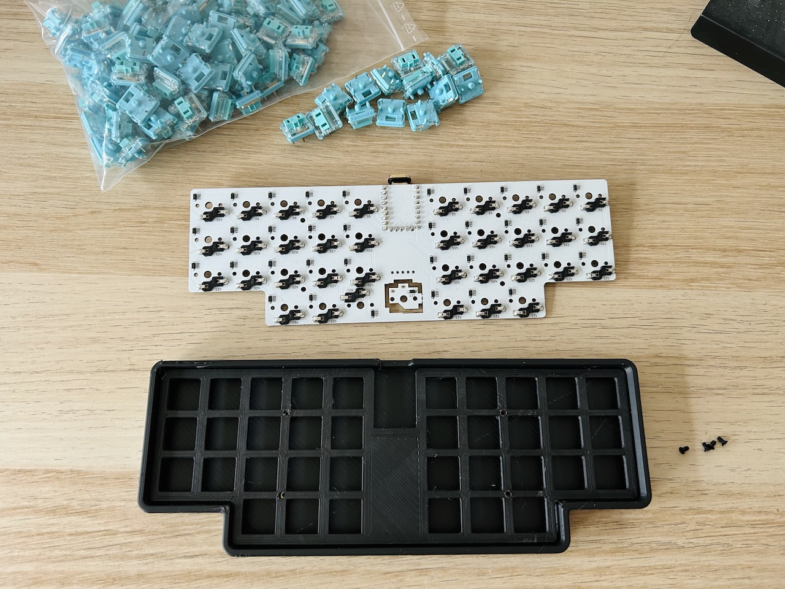
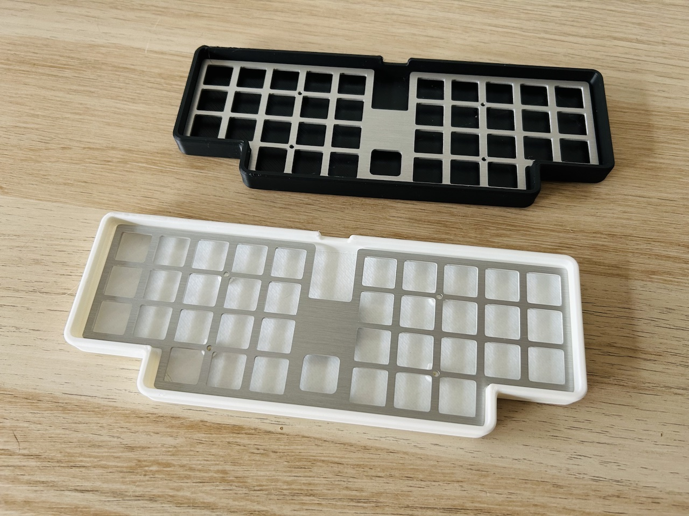
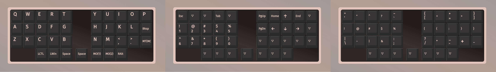

# Haori36

Low-pro 36-key hot-swappable monoblock split ortho keyboard with optional Pimoroni trackball support. 

## Production Files

To place an order for the Haori36 PCB: 

- Use the gerber files in the [production/](production/) folder. 
- Optionally one can utilize the [BOM](production/BOM.csv) and [CPL](production/CPL.csv) files with a PCBA service to avoid manually soldering SMD diodes, which can be challenging to solder by hand. All components are soldered to the bottom side of the board. 

The complete PCB project is in the [kicad/](kicad/) folder. 

## Bill of Materials (BOM)

Quantity | Item 
--- | --- 
1 | RP2040-Zero & Pin headers 
1 | Haori36 PCB 
1 | Haori36 plate 
36 | Kailh Choc V1 switches  
36 | Kailh Choc V1 Hot-swap sockets 
36 | 1N4148 diodes (SMD)
1 | Pimoroni Trackball Breakout (optional)
4 | M2x4 heat-set thread inserts
4 | M2x6 screws 

## Case and Plate 

3D print the case with the [STL file](case/haori36-case.stl). 

|  |  |
|---|---|

There are multiple options for the plate:

- 3D print using the [STL file](plate/haori36-plate.stl) (or the [no-trackball](plate/haori36-plate-notrakball.stl) version).
    - Adjust the tolerance settings as needed. As a reference, I set the `Initial Layer Horizontal Expansion` to `-0.3mm` and the `Horizontal Expansion` for subsequent layers to `-0.1mm`.
- Use PCB material with the [plate gerber files](production/haori36-plate-gerbers.zip), and opt for `1.6mm` or `2.0mm` PCB thickness. 
- Laser cut with the [DXF file](plate/haori36-plate.dxf).

The folder also contains an editable [STEP file](case/Haori36-case.step) for customization. 

## Firmware 

The Haori36 comes with precompiled VIA-enabled firmware, with trackball enabled by default: 

- Flash [penk_haori36_via.uf2](firmware/penk_haori36_via.uf2) to the RP2040-Zero.
- Load the [via.json](firmware/QMK/via.json) file in `Design` tab for [VIA](https://usevia.app) configuration.

### Default Keymaps

The firmware source is located under [firmware/QMK/](firmware/QMK/). 
The trackball settings can be adjusted in [rules.mk](firmware/QMK/keymaps/via/rules.mk) and [config.h](firmware/QMK/keymaps/via/config.h). 

## Copyright and License
Copyright (c) 2024 Penk Chen. All rights reserved.

All files are licensed under MIT license, see the [LICENSE](LICENSE) for more information.
